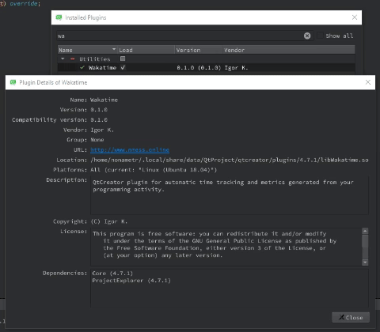

# Fork

This repo is a fork of https://github.com/nonametr/qtcreator-wakatime. The original repo provides binary plugin up to Qtc4.9, which is too old to work with the latest Qtc.
The Travis-CI is employed to automaticlly compile the plugin and deploy to the GITHUB RELEASES and some code has been modifed to enable the plugin to compile succefully in Qt 5.9LTS.

The original README:
# qtcreator-wakatime
QtCreator plugin for automatic time tracking and metrics generated from your programming activity.

Linux build for QtCreator 4.7, 4.8, 4.9 can be found in `build` directory. Put libWakatime.so file into /path_to_qt_install_dir/QtCreator/lib/qtcreator/plugins, usualy it's in '~/Qt/Tools/QtCreator/lib/qtcreator/plugins'

Build instructions for Ubuntu(should be same for other distributions):

0. Check QtCreator build requirements https://github.com/qt-creator/qt-creator.git. Install Qt framework and Qt Creator from official web site(select appropriate version for your QtCreator build) and run apt install clang-8 clang-tools-8 cmake). This should be enought for plugin development but not for full qt creator build.
1. git clone https://github.com/qt-creator/qt-creator.git
2. cd qt-creator
3. If you are building plugin for QtCreator 4.9 run 'git checkout origin/4.9' or list all branches with 'git branch -a' and pick required version.
4. Build 'qt-creator' details here https://doc-snapshots.qt.io/qtcreator-extending/getting-and-building.html (also you can run build from other Qt Creator).
5. Open 'qtcreator-wakatime' project with qt creator
6. Replace "path_to_build" with your build directory isEmpty(IDE_BUILD_TREE): IDE_BUILD_TREE = "path_to_build"
7. Build plugin.

## Usage

